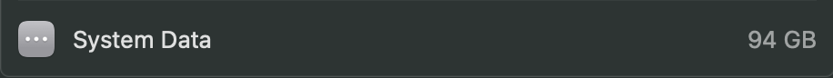
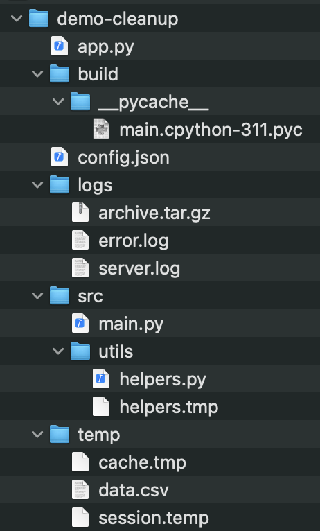

# Mac Cleaner

A small macOS command-line tool I built to learn more about filesystem
scanning, cleanup candidates, safety checks, and testing.

## Why I built this

I wanted to understand what actually contributes to macOS storage usage
and build a simple cleanup tool myself instead of relying on existing
cleanup applications.



While researching macOS storage, I found that "System Data" isn't one
specific folder that can simply be deleted. Because of that, I decided
to take a more conservative approach and only identify specific types
of files as cleanup candidates.

## What it does

The current version can:

- Recursively scan a directory
- Identify selected cleanup candidates
- Report their path, size, category, and reason
- Ask for explicit approval before deletion
- Validate candidates before deleting them
- Protect paths outside the scanned directory
- Handle deletion failures without stopping the entire cleanup
- Run automated tests with pytest

Current candidate rules include:

- `__pycache__` directories
- `.log` files
- `.tmp` files
- `.temp` files
- `.DS_Store` files

All candidates are treated as `investigate` rather than automatically
being considered safe to delete.

## How it works

```
SCAN → CLASSIFY → REPORT → USER APPROVAL → SAFETY CHECK → DELETE
```

## Quickstart

Create and activate a virtual environment:
```
python3 -m venv .venv
source .venv/bin/activate
```

Install testing dependencies
```
python -m pip install -r requirements.txt
```

Run the utility against a target directory:
```
python -m src /path/to/target
```

If no directory is provided, it scans the current directory.

### Running tests

```
python -m pytest
```

## Demo



[<video src="assets/output.mp4" controls></video>](https://github.com/user-attachments/assets/e15b6e88-599b-4ab1-90e2-9471cdb4ed69)

The demo shows the scanner finding candidates, asking for user approval,
and reporting the result of each cleanup attempt.

### What I learned

This project gave me practical experience with:

- Filesystem operations with pathlib

- Recursive directory scanning

- Rule-based classification

- Designing safety checks before destructive operations

- Building an interactive CLI

- Writing tests with pytest

- Testing filesystem errors with monkeypatch

- Structuring a Python project into separate modules

One of the main things I learned was that identifying a file as a
cleanup candidate is not the same as knowing that it is safe to delete.
That led me to add explicit user approval and safety checks before
deletion.

### Limitations

This is an early MVP. It intentionally avoids automatically touching
arbitrary macOS system or application data and does not decide that a
file is safe to delete based only on its size.

The current cleanup rules are also fairly limited and conservative.

## Future ideas
- [ ] Add more context-aware cleanup rules
- [ ] Add a dry-run mode
- [ ] Allow filtering candidates by category
- [ ] Improve post-cleanup reporting
